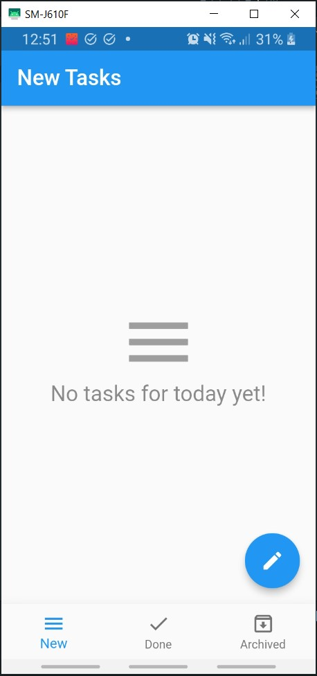
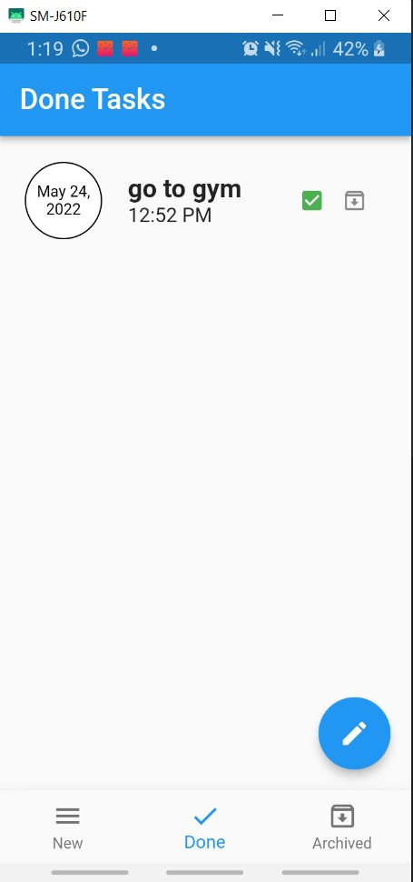
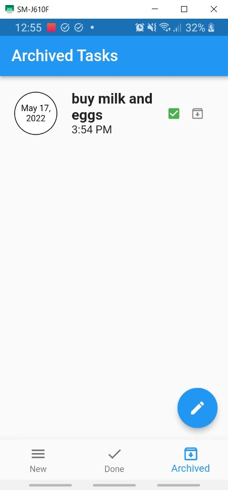

# Notes App

A todo app for daily tasks wit local storage using sqflite

## Tools 
### i used this tools to build this simple todo app 
<ul>
  <li>state management : cubit </li>
  <li>database : sqflite </li>
  <li>flutter basic widgets for ui </li>
  <li>intl package from pub dev to deal with time and date </li>
</ul>

## Home
this is the home page if you open the app anytime, you will find all your notes here

  

## Add New Notes
in this page you can see your current notes and add new note.
press the floting action button after finishing the required info to add a task,
once you add a task it's saved in the database

  

## Check Done Notes
Here you can find all the notes your marked done after finishing them, just to get back to them anytime

  

## See Archived Notes
Here you can find all the notes you put on the archive, maybe you want to some of them later

  

